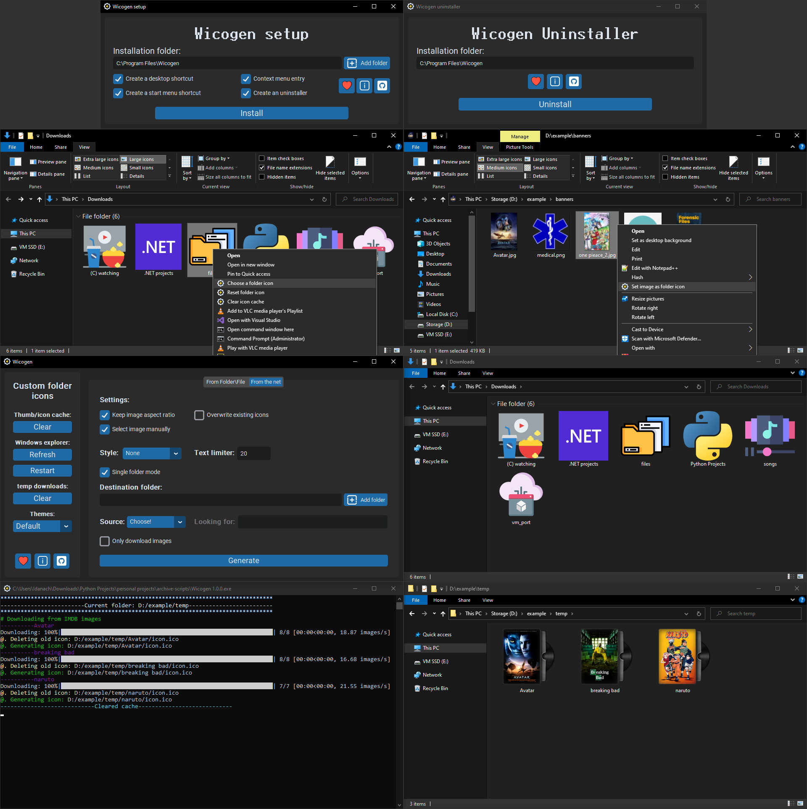

# Wicogen
Easily Customize your folders and make Windows suite to your taste! 
You can create folders from existing icons, apply them to folders, or even search the net for icons you like!

Download the portable program: [Wicogen](https://github.com/idanach/Wicogen-windows-icon-generator/releases/tag/V1.0.0)

Supported sources for online search: 
  - Google images 
  - Bing images
  - IMDB (covers for movies and TV folders)
For Movie/TV, I recommend the disk style available in the drop-down.

If you find all the settings confusing, hover over the button, a Tooltip window will pop up.

For any questions or suggestions, feel free to do so in the discussions! 💬

# NOTICE:
After generating the icons for existing folders, it can take a couple of minutes to refresh (When creating new folders from icons, It should be instantaneous).

# Example:

# If you liked this project
⭐ Please leave a Star ;)

Or support me going to college : /

  

